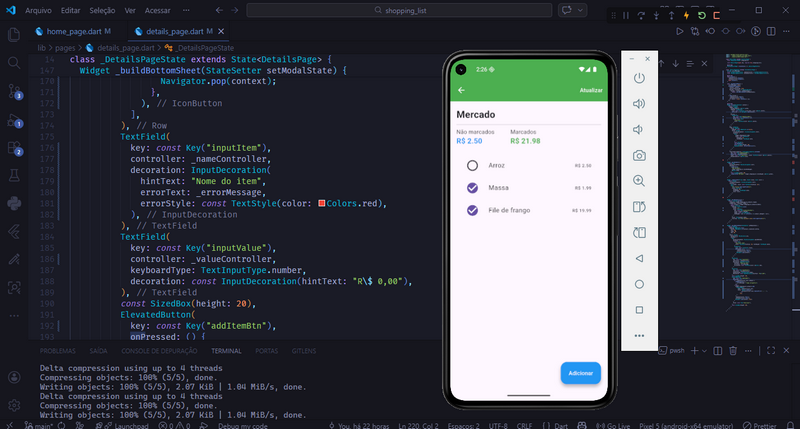

# 🛒 Shopping List – Flutter

Aplicação de **gerenciamento de listas de compras** desenvolvida em Flutter como desafio técnico para a **Growdev**. O projeto foca na criação de grupos de compras, manipulação de valores monetários e acompanhamento de progresso de itens adquiridos.

Projeto focado em:
* Gerenciamento de múltiplas listas de compras
* Cálculo automático de totais (Marcados vs Não marcados)
* Uso de chaves específicas para automação de testes
* Componentização e fidelidade visual ao protótipo
* Navegação entre telas e uso de Modais (Bottom Sheets)

## 📸 Screenshot



## 🚀 Funcionalidades

✅ **Criar listas de compras** com nomes personalizados
✅ **Visualizar progresso** através de barras de carregamento dinâmicas
✅ **Adicionar produtos** com nome e valor monetário
✅ **Marcar/Desmarcar itens** refletindo no resumo financeiro em tempo real
✅ **Resumo de gastos** exibindo montante de itens comprados e pendentes
✅ **Validação de formulário** para campos obrigatórios
✅ **Interface simples e organizada** seguindo fielmente o design proposto

## 🧩 Estrutura do projeto

### 🔹 Model

* **ProductModel**: Representa o item individual com nome, preço e status de compra.
* **ShoppingListModel**: Gerencia o grupo de produtos e contém a lógica de cálculo dos totais e porcentagem de progresso.

### 🔹 Pages

* **HomePage**: Tela principal que alterna entre o estado vazio (boas-vindas) e a listagem de cards de compras.
* **CreateListPage**: Tela dedicada para a entrada de dados e criação de um novo grupo de compras.
* **DetailsPage**: Tela de detalhes onde o usuário interage com os produtos e visualiza os somatórios financeiros.

## 🛠️ Tecnologias utilizadas

* **Flutter**
* **Dart**
* **Material Design**

## ▶️ Como rodar o projeto

```bash
# clonar o repositório
git clone [https://github.com/aleehblackstar/shopping_list.git](https://github.com/aleehblackstar/shopping_list.git)

# entrar na pasta
cd shopping_list

# instalar dependências
flutter pub get

# executar o projeto
flutter run